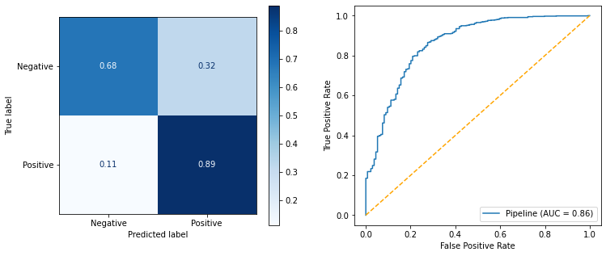
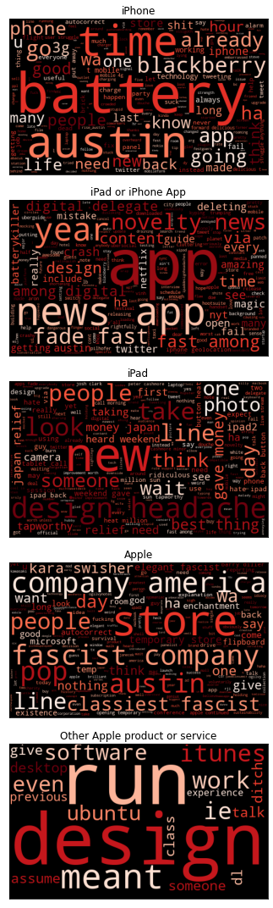

# Decyphering the Public Opinion on Apple
## Conducting a Twitter sentiment analysis for the SXSW Conference
&nbsp;

**Author:** E. Berke Tezcan

***


Image from https://scrapingrobot.com/wp-content/uploads/2020/02/sentiment-analysis-blog-header-small.jpg?ver=1.01-398

## Introduction

In the world we live in today, social media affects not only our personal lives but the day-to-day operations of businesses as well. With the world being more connected than ever, it is crucial for businesses to be able to read the public opinion about their products and brand, and adapt to changing trends as quickly as possible or even stay ahead of them. Staying connected and being in-the-know not only allows businesses to stay relevant but also provides them with opportunities to achieve and maintain financial success. 

One of the many applications of this idea is when large companies such as Apple or Google hold their keynotes (Apple's WWDC or Google's I/O for example) and release new products, software updates and tease upcoming changes to their services. Another is when senior leadership within these companies attend large conferences and talk about the vision of their company and provide fans with hints as to what they can expect in the future. These are golden opportunities for these companies' marketing teams to gauge interest and gather information on public opinion.

One medium that companies can utilize to read public opinion is Twitter. Millions of people share their thoughts on various topics on Twitter every day, so this makes Twitter a great resource for businesses. For this project, we were hired by Apple to conduct a sentiment analysis of tweets from the SXSW (South by Southwest) Conference. Below are the questions we will be providing insights for:

**1. How is Apple perceived as a company during the SXSW Conference, and how does this compare to Google as one of their main competitors?**

**2. How are Apple and Google's products and announcements perceived during the SXSW Conference? Are there specific pain points within the products that Apple should address?**

Additionally, we will be training and testing different machine learning models that can classify tweets based on their sentiment. Apple can leverage these models to read the public opinion and stay ahead of their competition.


## Data
We used a dataset from [data.world provided by CrowdFlower](https://data.world/crowdflower/brands-and-product-emotions) which contains 9,093 tweets about Apple and Google from the South by Southwest (SXSW) Conference. The tweet labels were crowdsourced and reflect which emotion they convey and what product/service/company this emotion is directed at based on the content.

## Methods
We started off with scrubbing and in the meantime exploring the dataset to understand the columns and the dataset overall. After simplifying the sentiment labels to "Positive", "Neutral" and "Negative",  addressing duplicates and null values we moved onto exploratory data analysis (EDA). 

During our EDA, we looked at tweets with positive and negative sentiments as a whole as well as on a company and product level to answer the questions mentioned in the introduction section. Wordclouds were generated for each analysis. To be able to produce these graphics the tweets were tokenized with nltk's TweetTokenizer since it has built-in functionality for tweets specifically, lemmatized with the WordNetLemmatizer and stop words were removed from these tokens. We customized stop words to get a better view of the content of the tweets for addressing the questions.

Our modelling process was split in two: Binary Classification and Multiclass Classification. For each type of classification, data was prepared and a baseline dummy classifier model was trained to serve as a baseline. For comparison we trained/tested Random Forest models and Logistic Regression models for Multiclass Classification while adding on Multinomial Naive Bayes for the Binary Classification on top of these.

 We evaluated each model and tuned hyperparameters with gridsearches that optimized for the recall macro scores since we wanted the models to correctly classify all classes. These steps were repeated after data was randomly oversampled.

## Results
### Binary Classification

For the binary classification problem, the best model was the tuned random oversampled Multinomial Naive Bayes model based on the recall macro score of 0.79. It was then closely followed by the tuned Logistic Regression model with a recall macro score of 0.78. 

Overall, we consider the Logistic Regression to have won over the Multinomial Naive Bayes model because it was not oversampled and marginally less overfit. It additionally provides more opportunities for tuning the model in the future, if desired, since it is a more complex model.



### Multiclass Classification

The winner of this task was the tuned oversampled logistic regression model with a recall macro score of 0.62. The tuned random oversampled logistic regression model also scored the same 0.62; however, since it got to the same score only after the random oversampling we are declaring the non-oversampled model as the winner.


### Percentages of Different Sentiments for Apple


> Above, we can see that most tweets that were connected to Apple were positive (81.1%) while 16.1% of tweets were negative and 2.7% were neutral. This is very helpful to see since it indicates that the view of Apple as a company and it's products and services are mostly positive. However, this does not provide us with information on where the areas of improvement should be or what is liked about Apple's products. In order to get a better understanding, we looked at the sentiment wordclouds on a product/service level for Apple.

### Sentiment Analysis of Apple Related Products/Services

  

> Please see the conclusions section for insights on these wordclouds.

### Percentages of Different Sentiments for Google


> Above, we see that 82% of tweets related to Google were positive, 14.9% were negative and 2.96% were neutral. Once again, taking our analysis to a more granular level and looking at the specific products under each sentiment revealed more information.

### Sentiment Analysis of Google Related Products/Services

  

> Please see the conclusions section for insights on these wordclouds.

## Conclusions & Recommendations

Today, it is more important than ever for businesses to be in tune with their customers. "Listening" to the public opinion on their products and services not only allows for them to maintain financial success, but also provides them with opportunities to stay competitive in the market. To sum up, our analysis showed the following:

**1. How is Apple perceived as a company during the SXSW Conference, and how does this compare to Google as one of their main competitors?**

- During the SXSW Conference, 81.1% of all tweets related to Apple were positive compared to Google's 82%.
- During the SXSW Conference, 16.1% of all tweets related to Apple were negative compared to Google's 14.9%

This suggests that both companies and their products and services are perceived mostly in a positive way. 

**2. How are Apple and Google's products and announcements perceived during the SXSW Conference? Are there specific pain points within the products that Apple should address?**

Apple - Positives:
- Tweets about Apple suggest that the temporary pop-up store announcement in downtown Austin has been received very well by Apple fans and generated a lot of excitement for the brand. 
- One of the most frequently talked about products was the iPad 2 which seems to have been launched during SXSW and sold in the Austin temporary pop-up store. Based on the tweets, Apple's launch of this product definitely generated a lot of buzz.
- Samplers and free products/services were frequently mentioned as well.

Apple - Negatives:
- The iPhone's battery is frequently discussed in negative tweets.
- Design of the iPad was referred to as a "design headache."
- There are several tweets mentioning Kara Swisher and references to Apple as a "fascist company."
- Several apps are referred to as "battery killer" and the design of the News app seems to have not been received positively.

Google - Positives:
- Google's party in Lustre Pearl generated a lot of buzz.
- Marissa Mayer is mentioned extensively, so her talk was positively received.
- Google's new social network project "Circle" seems to have caused a lot of excitement.
- Microsoft's Bing search engine is mentioned in a negative way.

Google - Negatives:
- Some users seem to be having issues with Android OS based on words such as "buggy", "replaced", and "painful."
- Samsung is mentioned in tweets with relation to Android suggesting some users may prefer it to Google's products.
- Users of Meetup are having problems with Android.

## Recommendations

In light of the insights we provided above, our recommendations for Apple are as follows:

- Users are not happy with iPhone's battery performance and therefore more R&D in this area may be needed.
- Some users also don't seem to like the iPad's design. It may be fruitful to look more into this issue and potentially conduct a survey with users to understand the downsides of the current design.
- Users seem to be having several issues with Android apps. This may be a great opportunity for Apple to make sure these issues don't exist in iOS and market their products to these users.
- The marketing strategy for the new pop-up store seems to have been successful. It can be employed in conjuction with other conferences or major events.
- Based on the response to Google's party, it may be effective to throw a party during the next SXSW Conference to generate excitement.

## Limitations & Next Steps

The dataset we used was a crowdsourced dataset which brings about certain challenges, one of which is that labeling tweets as "Positive", "Negative" or "No emotion" can be a highly subjective exercise. What I may think is a positive tweet, someone else may interpret as negative. Additionally, the context of these tweets matter. Since we don't know the methodology of how the data was labeled, there could have been human error in labeling where a tweet that was intended to be sarcastic can be labeled incorrectly for example. This would negatively impact the quality of the data. 

Furthermore, our dataset consisted of 9,092 tweets which is a fairly small number. After removing neutral tweets we were only left with around 3,000 tweets for the binary classification. So, the amount of data used was limited. Additionally, the class imbalance was pretty significant with approximately 61% of data being neutral, 33% being positive and 6% being negative. Arguably, the "Negative" class would be much more important than the "Neutral" class in trying to understand where the areas of improvement are for Apple in general.

As next steps, if Apple would like to generalize these models for different applications, we would definitely gather more data from Twitter and potentially other sources. Additionally, if the data had to be labeled by humans, we would set guidelines for what each class of tweet would consist of with examples to make sure that the labels didn't solely rely on emotions. Furthermore, taking the average of sentiment labels for each tweet would result in more accurate labels.

Lastly, the performance of the models could be greatly improved by rethinking this project with Neural Networks. In the future we would use Deep NLP to classify tweets.

## For More Information

Please review my full analysis in [my Jupyter Notebook](./final_notebook.ipynb) or my [presentation](./presentation.pdf). For any additional questions, please contact Berke Tezcan at berketezcan@gmail.com.

&nbsp;
### Repository Structure


```

├── README.md               <- The top-level README for reviewers of this project.
├── final_notebook.ipynb    <- Narrative documentation of analysis in jupyter notebook
├── notebook.pdf            <- Narrative documentation of analysis in PDF
├── presentation.pdf        <- PDF version of project presentation
├── images                  <- Both sourced externally and generated from code
└── data                    <- Externally sourced data